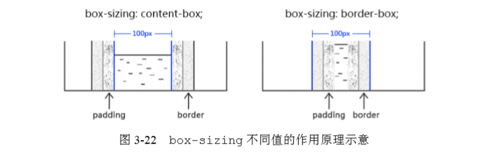

## 为什么list-item元素会出现项目符号
* 在块级盒子加了一个附加盒子，而附加盒子（学名也叫标记盒子）专门存放项目符号。

## display:inline-table 的盒子
* 外面是“内联盒子”，里面是“table 盒子”。得到的就是一个可以和 文字在一行中显示的表格。 

##  width/height 作用在哪个盒子上 
* 内在盒子，也就 是“容器盒子”

## width:auto  四种不同的宽度表现
* 充分利用可用空间（\<div>、\<p>这些元素的宽度默认是 100%于父级容器）
* 收缩与包裹。(典型代表就是浮动、绝对定位、inline-block 元素或 table 元素)
* 收缩到最小(容易出现在 table-layout 为 auto 的表格中)
* 超出容器限制(内容很长的连续的英文和数字，或者内联 元素被设置了 white-space:nowrap)

## 流动性
* 内容很长的连续的英文和数字，或者内联 元素被设置了 white-space:nowrap
## 四个内在盒子
“内在盒子”又被分成了 4 个盒子，分别是 content box、padding box、border box 和 margin box
## 避免页面布局错位问题
* 书写方式约束，如使 用“宽度分离原则”。 （ CSS 中的 width 属性不与影响宽度的 padding/border（有 时候包括 margin）属性共存，`width 独立占用一层标签`，而 padding、border、margin 利用流动性在内部自适应呈现。）
```css
.box { width: 100px; border: 1px solid; } /*不采用这个方式*/


/*采用下面这种，width单独占一个标签，里面再占一个，让其宽度自适应*/
.father {    width: 180px; } 
.son {    margin: 0 20px;    padding: 20px;    border: 1px solid; } 

```
* 改变 width/height 作用细节的 box-sizing。，box-sizing 的作用就是可以把 width 作用的盒子变成其他几个， 


## height的一些属性值
* height:auto (有几个元素盒子，每个多高，然后一加，就是终的高度值了。 )
* height:100% (如果包含 块的高度没有显式指定（即高度由内容决定），并且该元素不是绝对定位，则计算值为 auto)

### 如何让元素支持 height:100%效果 
* 设定显式的高度值。
* 使用绝对定位(绝对定位元素的百分比计算和非绝对定位元素的百分比计算是有区别的，区别 在于绝对定位的宽高百分比计算是相对于 padding box 的，也就是说会把 padding 大小值计算 在内，但是，非绝对定位元素则是相对于 content box 计算的。 )


## 浏览器渲染的基本原理
首先，先下载文档内容，加载头部的 样式资源（如果有的话），然后按照从上而下、自外而内的顺序渲染 DOM 内容

## 任意高度元素的展开收起动画技术 
* 控制 display 属性值 在none 和其他值之间切换
* 是使用 height + overflow:hidden 实现（但是，很多时候，我们展 开的元素内容是动态的，换句话说高度是不固定的，因此，height 使用的值是默认的 auto， 应该都知道的 auto 是个关键字值，并非数值，正如 height:100%的 100%无法和 auto 相计 算一样，从 0px 到 auto 也是无法计算的，因此无法形成过渡或动画效果）
* 不妨试试 max-height+overflow:hidden（我们只需要设定为保证比展开内容高度大的值就可以，因为 max-height 值比 height 计算值大的时候，元素的高度就是 height 属性的 计算高度，在本交互中，也就是 height:auto 时候的高度值）

### 从作用上来讲，块级负责结构，内联负 责内容

### “内联元素”的“内联”特指“外在盒子”，和“display 为 inline 的元素”不是一个概念！inline-block 和 inline-table 都是“内联元素”，因为它们的 “外在盒子”都是内联盒子

### 支撑盒子 `strut`